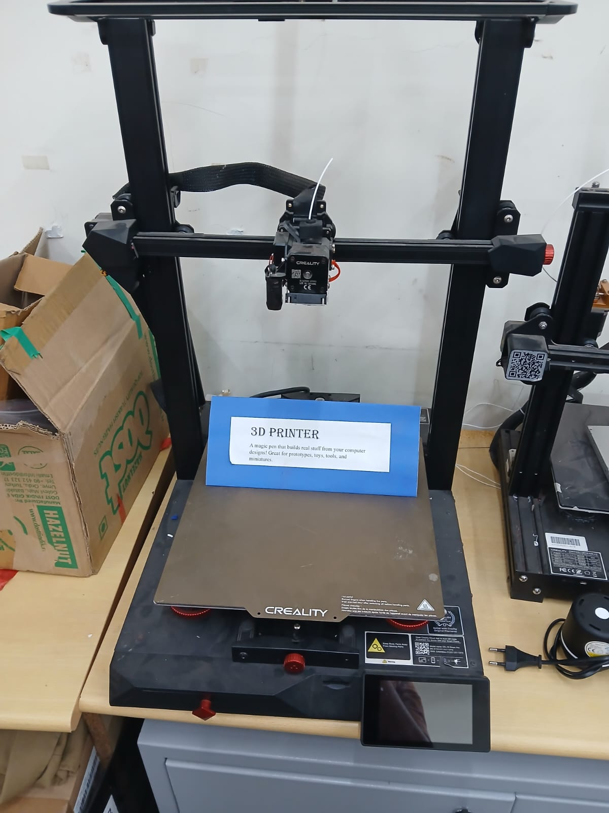
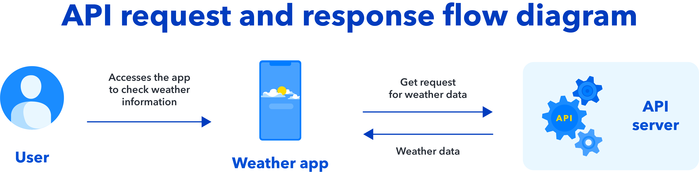
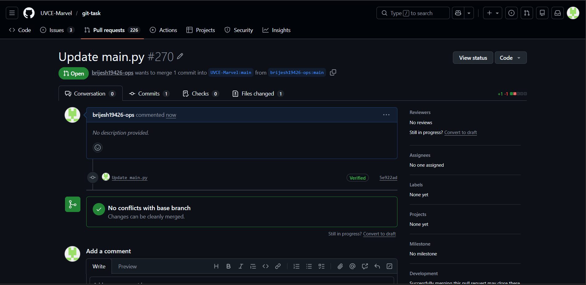
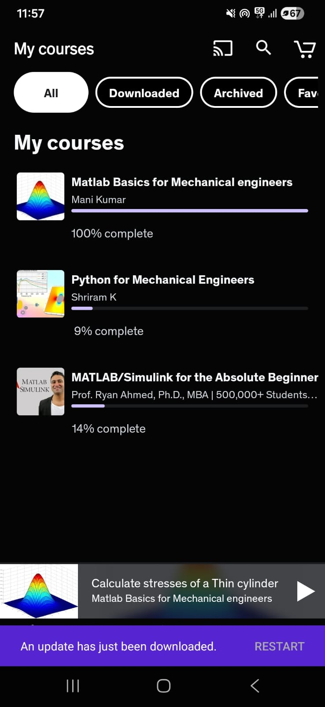
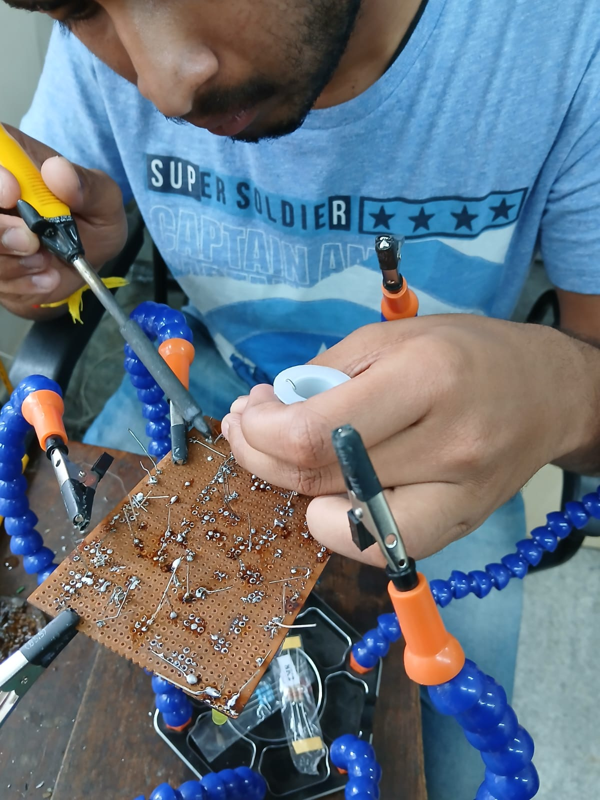

# BRIJESH's LEVEL 0 REPORT

#  TASK : 3-D PRINTING

3-D priniting is the next big thing in the manufacturing industry 
additive 3-d printing and metal printing are the ones being worked upon now 
In 3-D printing the plastic filament of the desired type of material is selected and used to print the model we want 
This is mainly used becasue it increses the accuracy and precision of the parts being printed 
It's easy to print it then to make a mould ofr it and use it to manufacture 
It consumes a lot of less time and requires less human labour and efforts 

 

### OBJECTIVES OF THE TASK :
Understand the working of a 3D printer 
Understand what's an STL file, and then learn to slice it  

### My Understanding :

Major components of a 3-D printer are the:

X,Y,Z axised frame  

Heated printing nozzle:the plastic filament gets heated and the stepper motors prints it accuratekly layer by layer the heated plastuc flows out through the nozzle getting printed layer by layer 

Filament roll: the desired material for the printing is selected and its composite roll is placed to be fed the printing unit 

Printing bed:all the heated filament gets printed on this printing bed it's where the final piece is present after printing it is coated with non adhesive and sticky coatings of ceramics and glss so that the printed piece dosent stick to the printe bed andit can be easily emoved after printing

STL files :
It stands for stereolithography its the most comman file format used in 3D printing 
It describes the surface geometry of the of the 3D model 
It's basically a file extension which saves the file the stk format
I used cults website to download the 3d model in stl format 

SLICING:
It's the bridge between our 3D model and the 3D printer 
It's a software that instructs the 3D printer how to print layer by layer our model to obtain the final piece 
It divide the model into many thin horizontal layers where each gets printed in a sequential order 
I used Ultimaker Cura TO slice the 3D model which I downloaded from cults to understand how slicing happens saw a youtube video on how to work in it 

### Conclusion :
How a 3D printer works 
The principles whic it harnours 
How the melted filament gets printed 
What is an STL file , why it's important 
What is Slicing and why its important for 3D printing 
How a file or model gets printed on the slicing principle
 

#  TASK : API [APPLICATION PROGRAMMING INTERFACE]

It is a set of rules that lets different software programs talk to each other, exchange data, and work together. You can think of it as a messenger that takes requests from one program, delivers them to another, and brings back the response.

### OBJECTIVES :

Using any api of our choice to build an user interfacelike a web app or mobile app

### MY LEARNINGS :

Learnt what is an API

It's applications and it's working principle 

How it accepts info from user contacts the related , linked server and gets its info to the user 

It basically acts as a bridge between the user and a data server accesing its informations

It's interface will be very user friendly and easy to use so that anyone can access it and obtain the information they need 

How to link my js code and the api key to acess live information from the server and show it to the user 

The interface can be both dynamic or static based on the coder 
its easy make a form for input type of text and submit and out it in the code it will make it dynamic 

# TASK : GITHUB 
 
GitHub is a free, web-based platform where developers store code, track changes, and collaborate on projects. 

It’s built on Git (a version control system) and is widely used for teamwork, open-source contributions, and project management.

### OBJECTIVES :

Famirilize with interface and how it works and the various options present in it
Issues, and pull requests with this task.

### MY Learnings :

GitHub is a platform that helps developers store code, track changes, and collaborate. It uses Git for version control and adds features like repositories, branching, pull requests, and project boards. 

How ton edit codes and how to save changes

How to check the libraries and see who edited and made changes to the code 

FORKING

Making a PULL request

# TASK : Ubuntu Command Lines and Promopts 

Ubuntu is a free, open-source operating system based on Linux, designed to be user-friendly, secure, and versatile, making it suitable for desktops, servers, and cloud computing.
In short, Ubuntu is preferred because it’s cost-effective, safe, customizable, and supported by a strong community, making it a reliable option for everyday use and learning.

The terminal comamnds are very case sensitive so that also should be kept in head 

### OBJECTIVES :
Understanding ubuntu  as an OS 
Learning the basic commands in it 
Learning how to create and delete directories and files in the terminal 
Learning how to manipulate and copy files how to move files and directories 
Understanding the superuser 

### My Learnings :
In this task I learnt what is an OS like we all have used it but didn't know about it in depth 
I learnt how an OS works what all are its aspects and different types of OS which led to installing and learning ubuntu and it's essential command prompts 
There are many command prompts in it all follow a structured flow of command chain and many commands serves the same purpose like:

1.whoami and pwd 
There are some basic commands like pwd , cd , mv which are like the basic most commonly used and specific functions 

Then comes some autroritative commands like:

mkdir : it is used to create new directories 

rm : it is used to remove directories and files ,  files get deketed easily but if the any directory has any content it cannot delete those directories 

-r : is an autoritative command which removes the files and directories even if it has any stored contents

-p : makes adirectory wirhin a directory

Key points to remember is that it's case sensitive and the usage of " .. " , " / " , " .. " should be proper and have proper ordered spacing between them so that the code gets executed perfectly as per the user requirements 

# TASK : Portfolio Webpage
A portfolio web page is a personal or professional website designed to showcase your skills, projects, and achievements—essentially serving as your digital résumé or business card. It helps potential employers, clients, or collaborators quickly understand your expertise and style.

### OBJECTIVES :

Learn how to code in HTML and CSS frameset 

Make a Portfolio Web Page using what you learnt 

### My learnings :

How to code in HTML with CSS 

learnt about Frame works and linking (internal linking) linking within a web page 

Frameset basics and how to divide frames in he web page 

[Portfolio web page](portfolio.html)

# TASK : Report Writing Using Markdown 
 
Markdown is not a programming language—it’s a lightweight markup language that makes text easy to format and read. In simple terms, it’s a way to add styles (like bold, headings, or lists) to plain text without complicated code.

### OBJECTIVES :

Learn the basics of scripting language 
Learn how to format scrpits in markdown like bolds , italics , underlined with many different headings and adding images and viudeos to the scripted file 

### My Learnings :

Well I didn't have the liberty to fast learn this topic as all the MARVEL repoerts are to be written in this scripting language only so I  had no other option but to learn about this in-detail

It's basically like HTML with a lesser number of functionalities 

It can be best described as a notepad or journal file with a bit more formatting features such as adding photos and videos to it 

It's applications can be found in article writing and report writings 

There are a numbver of ways to use this editor 

We can access it by notepad by typing the code and saving the file with " .md  "extension
or by VS code or any other text editor's 

It can also be accessed using many online tect editors 
Learnt various ways you can add an image to this script by using github etc

[article](Article.md)

# TASK : TINKERCAD

Tinkercad is a free, beginner-friendly online platform by Autodesk that lets you design 3D models, simulate electronic circuits, and even learn coding—all directly in your web browser without installing software. 

### APPLICATIONS :
It’s widely used by students, hobbyists, and educators for learning, prototyping, and experimenting.

### OBJECTIVES :

Creating a Tinkercad account and getting familirised with the interface
Using the sample circuits and learnuing how to execute codes on it 
Making a simple model using an ultrasonic sensor to estimate the distance between an obstacle and the sensor. Display the results on the serial monitor.

### My Learnings :

Familirised myself with the interface of the website how to use various components    
Learnt how to create new files and projects how to edit and delete them
I learnt how to use the various Pcb present in the website 
How to make all the connections and how to use all the individual pieces and make something usefull out of it 
How to use the various code and promt lines present in the coding section , debugging and checking the various component's functionality at the same time
Color coding of wires and how to connect them to the components

https://github.com/brijesh19426-ops/photos/blob/87a977250dd8153bb55711f5a815cb617c14b733/tinkercad%201.png

#  TASK : ACTIVE PARTICIPATION 

### OBJECTIVES :

Participate in an Technical event
Ateend any MOOC and complete the course 

### MY learning and experiences :

I participated in the scaler school of technology's tech fest YUGANTARA althouh the category in which I particiapted cannot be called as technical event I did explore many onging e-sports tournaments , the poster printing they had set up 
looked around their R&D labs 
explored the type of projects they ar workinfg on currently
How they are using latest technology like AI in their works to make it more efficient and productive 
had many interactions with many seniors of the clg and the guests they had invited to do seminars 
participated in one of the seminars they held about the ceo of a leading upi payments app whise name i forgot but still remember the insights and values he tried to convey 

In udemy i've done a matlab course which wss free and open for all asoer the mooc course specifications 
It taughtv me about matlab it's interface its working principle etc. 
It's basically a calculator for Engineers 

 
 

# TASK : DATASHEET REPORT WRITING 

### OBJECTIVES :

Study the datasheet of L293D motor 

Specify about the ICs used in L293D, PWM, H-bridge 

### Report on L293D Motor Driver IC

The L293D motor driver is the best and versatile IC that simplifies the control of DC motors. 

It's H-bridge configuration and PWM capability allow for precise control of motor direction and speed, making it an essential component in many electronic and robotic projects.

### MY LEARNINGS :

The IC used in the L293D motor 

What is pwm and how it is used here 

H-bridge , what is it and how it matters 

##### IC's used :

The L293D itself is an IC used to drive motors 

Contains two internal H-Bridge circuits

A microcontroller sends control signals to the L293D (generally present in the arduino uno)

##### PWM :

Speed control is done using Pulse Width Modulation.

The microcontroller produces PWM signals

PWM is applied to the Enable pin of the L293D motor driver IC

Motor speed changes based on duty cycle

##### H-BRIDGE :

An H-Bridge is a circuit that lets current flow through a motor in either direction, allowing the motor to rotate clockwise or counter-clockwise.

It is called an “H” bridge because the switching elements are arranged like the letter H
An H-Bridge is a circuit that lets current flow through a motor in either direction, allowing the motor to rotate clockwise or counter-clockwise.

It is called an “H” bridge because the switching elements are arranged like the letter H.

# TASK : K-MAP AND DERIVING LOGIVE GATES

### K-MAP :

A Karnaugh Map is a graphical method used to simplify Boolean expressions. Instead of algebraic manipulation, you place values from the truth table into a grid and group them to find the simplest logic equation.
  
### LOGIC GATES :

Logic gates are electronic devices that perform basic Boolean operations (AND, OR, NOT, etc.) on one or more inputs to produce a single output. They’re the foundation of digital electronics, used in computers, alarms, calculators, and more.

### OBJECTIVES :

Determine the K-MAP and make a burglar alarm system using simple logic circuits. The buzzer or led's blinks when certain conditions are met, it utilizes push buttons for the door and key.

### My Learnings :

Understood what a are logical gates , it's representation and it types  , how it functions and the typess of operations it performs 

Understood about K-Maps how to draw one and how to write it's truth tables and how to prove any given logical exquation using booloean algebra and how to draw truth tables for these boolean algebraic expressions

The burglar system activates the alarm when the door is open and the key is pressed. The alarm works on this principke that if the door is opened by an authoried entry and the key is again being pressed it's being pressed by an intruder 

The K-MAP explaining this can be seen below :

# TASK : SOLDERING PRE-REQUISITES

Soldering is a process used to join two or more metal parts together by melting a filler metal called solder. The solder cools and solidifies, creating both a mechanical and electrical connection.

### OBJRCTIVES :
Learn about the various parts of the soldering meachine 
Learn about solering filaments (solder) and wax 
Learn how to soleder 

### My Learnings :
The working pinciple o the soldering machine , i.e the process of heating the tip of the metal 
Curie's temperature 
How to clean the tip 
The tip is the part which gets the most heated so its important to handle it properly 
How to solder elcectronic boards and circuits 
The dont's was better learrnt than the do's 
wax is used so that thers no like dust particles or other contaminations on the soldering tip which might interfere in  soldering 
How to clean the tip using the sandpaper 
How to de-solder although I didn't use the actual de-soldering machine I learnt how to use it
and when to use it 
How to control the voltage which regulates the amount of heat needed to be used 

# TASK : Speed Control of DC Motor

### OBJECTIVES :
To control the speed of an h-bridge L298N motor driver using an  L298N motor module and arduino uno

### MY LEARNINGS :

I learnt how an L298N motor driver functions and what are it's various sockets and connections and that we can hook it upto 2  motors simultaneously 

The basic working principle of the H-bridge L298N motor driver and how it changes the speed based on the periodically altering volatge supply provided to it by the L298N motor driver 

The H-bridge L298N motor driver has 4 electrodes which control direction and speed based on the applied voltage it has its own specific truth tables for this process to happen and the fluctuating volatage is supplied by the L298N motor module in the high voltage mode one series of network will be connected and the motor will rotate in one direction and speed , when a lower voltage is applied the switch changes and a new network will be initiated which rotates the motor in different direction and different speed 

It has the 4 electrodes arranged in the forma of an H with a switch in middle and sides which governs the speed and direction the H-bridge L298N motor 

The aurdiono board takes care of the execution of the code instructing the L298N motor module which specifies the module to supply the right amount of voltage at set intervals 
controlling the execution of the desired output 

https://github.com/user-attachments/assets/1629743b-1a8d-42cc-8cd7-c91156f7f964

#  TASK : VIRTUAL REALITY

Virtual Reality is  is one of the most fascinating concept of technology and human experience. At its core, VR uses computer-generated environments to immerse people in a simulated world that feels natural and real. Instead of just looking at a screen,we step inside the digital space with the help of headsets, motion controllers. like the film Ready Play One

### OBJECTIVES :
To be able to differentiate between AR and VR
Experienc an VR system 
Mention about the trends in the space and technology 
Make about Indian companies in this space

### My Learnings :
VR : It stands for virtual reality it's like a secondary earth a set of programs and codes which when run let's the user experience this artifically created world in it's entirety as if the user has beem re-incarnated in this artificially created world 
The motion sensors and the moment readers in thwe hardware converts each moves into electronic signals and passes it to the program there is  very less time lag in the transfring of the information to the program 
We the users are the supreme controllers in this artificually creatwd world and can alter it the way we want changing landscapes and many other natural terrain as per our needs and desires 
This is the most simple definiton of VR

AR : All the people around the world utilize AR we commonly use it in our daily life without knowing about it 
The most basic and simple exam is our Smart Phones our Tablets and our laptops 
It utilizes pictures ,  audio and Graphics to bring the experienc of the real world to us in a 2d format
It's completely different from VR as there no rendering and everything like VR youre just being shown interactive videos with matching audios to experience it thats it 
Its's application can be seen in games like Pokemon GO
GOOGLE LENS
Snap Chat Filters 
 
How is VR being used in Space and Technology :
VR is being used in space technology and research mainly for -

Astronaut Training: 
Helping the astronaut by simulating the conditions and lifestyle in space , how to stay in zero gravity , how to be on the spaceships 
If the mission involves landing on foreign planets stimulating the conditons of that planets it's gravity and it's harsh condutions so that the astronauts can be prepared to face it  

Spacecraft Design:
to design the space craft in such a manner that it can handle the harsh conditons of re-entry or launch 
making the space craft fail proof and simulating the various conditions which might occur during its flight to test it , how well it handles the flight and certain un-forseen factors and to test various designs and materials of components to check if they can withstand the mission  

Medical support during long-duration missions:
in space with their fates constantly being tested certain astronauts may exprience fatigue and other symptoms which may lead to bad health or if there's any problem with their health any minor problems and they hurt themselves on the space shuttle thousands of km away from home VR is used to help perform operations on the injured or give them mental support helping them to complete their missions , rendering various simulations on how the operation might happen and deciding the best course of action all this is accompished using VR.

INDIAN Companies Leading in this field:
1. AutoVRse
2. Tesseract
3. Scapic

https://github.com/brijesh19426-ops/photos/blob/3edf4ec7f20e4a13dac2cc7526d0e7ccb3138cf8/vr1.png

# TASK : ESP32 LED TOGGLE

#### ESP32 :
The ESP32 is a low-cost, Wi-Fi-enabled microcontroller ideal for IoT projects. It’s powerful enough to handle web server tasks while remaining energy-efficient

#### OBJECTIVES :
Understanding the working of ESP32

Create a standalone web server with an ESP32 that controls the LED connected with ESP32 GPIOs

#### MY UNDERSTANDINGS :

ESP32 is an IC (micro controller) used to control the instruments via wifi or bluetooth

How connections are made in it and how it accssses using ip adress 

LED bulbs which we used has +ve and -ve terminals 

https://github.com/user-attachments/assets/6934194d-8472-4a60-85f8-cb525d4c2625

# TASK : 555 OSCILATOR

#### Objectives :

Design a 555 astable multivibrator with duty cycle 60%

Prepare a circuit on a breadboard 

Check the output using an oscilaotr scrren

#### MY UNDERSTANDINGS :

An 555 IC can be used to create a free running astable oscillator to continuously produce square wave pulses 

The circuit keeps switching between HIGH and LOW automatically during high voltage the capacitors get charged and output is seen 

During low voltage the capacitor discharges and the gaps is seen 

https://github.com/user-attachments/assets/74c9bfdc-a8cd-49fe-ba06-43a3b79cb2e0

